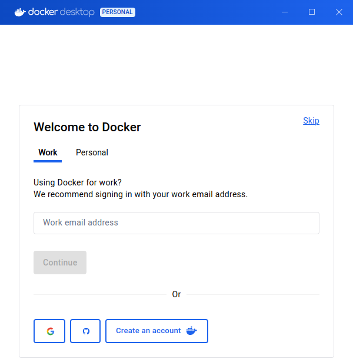
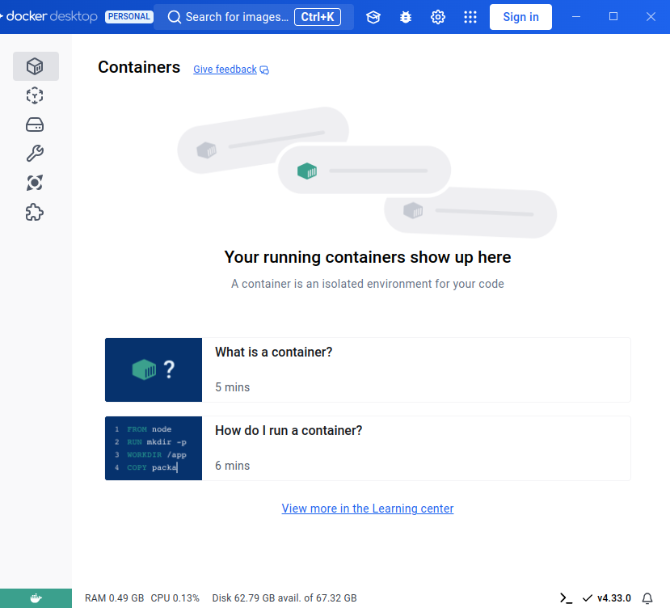
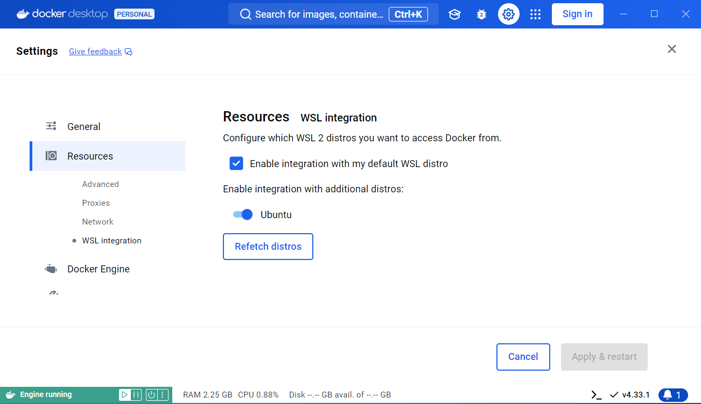
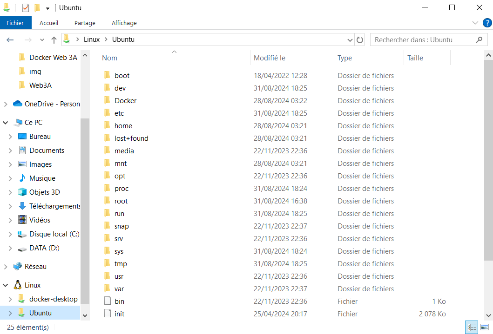
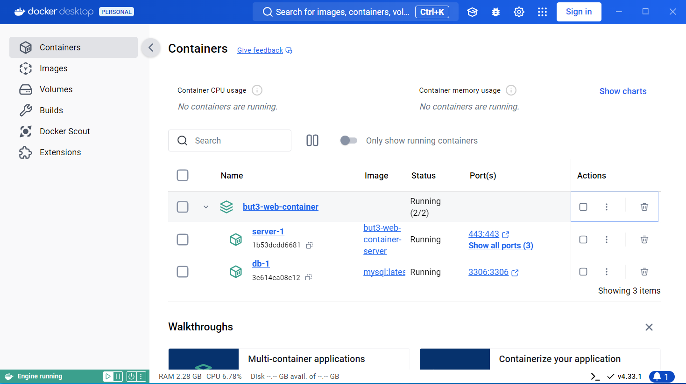
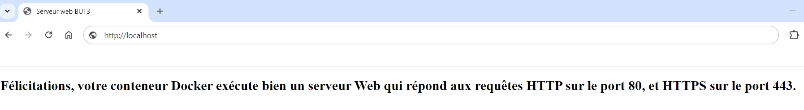
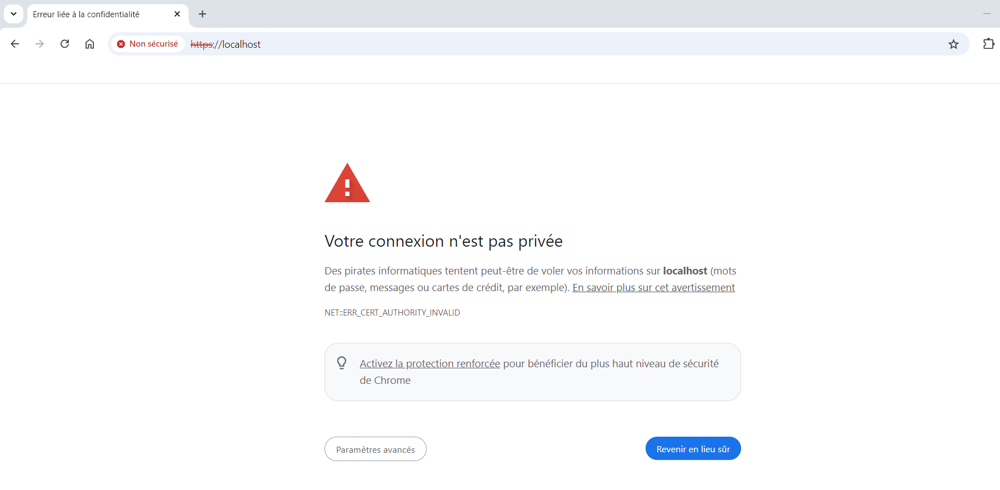
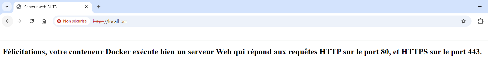
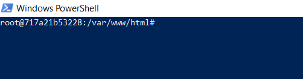
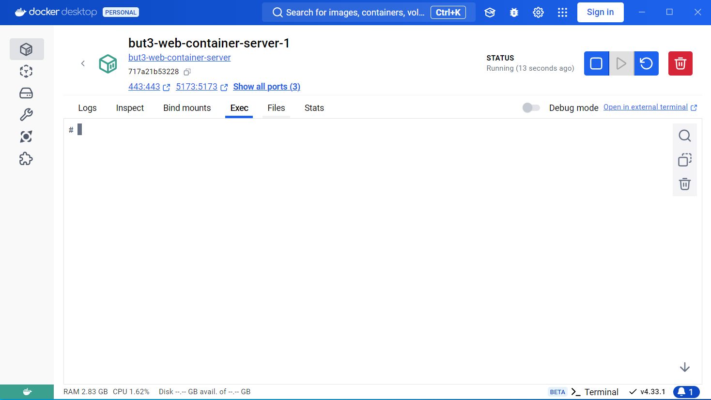

# Conteneur Docker pour le cours de Web de 3ème année

Afin de simplifier la mise en place de l'environnement de développement en évitant les divers problèmes de compatibilité selon votre machine ou votre système d'exploitation, le travail sur les différents TPs s'effectuera au travers d'un **conteneur Docker** configuré adéquatement et possédant tous les outils dont vous aurez besoin. Cela sera donc *a priori* la seule chose à installer.

Ce dépôt contient :

* Le présent tutoriel d'installation du conteneur (et de docker)
* Un fichier de configuration `Dockerfile` d'une image Docker contenant un serveur Web ainsi que divers outils pour développer des projets web (composer, npm, etc...).
* Un dossier `docker-config` contenant des fichiers nécessaires au fonctionnement du conteneur du serveur Web.
* Un fichier `compose.yaml` permettant de configurer un **conteneur multiservices** contenant deux services :
    * Un environnement `mysql` permettant de créer diverses bases de données.
    * Le serveur web, lié au service précédent (afin de pouvoir utiliser diverses bases de données dans les sites Web développés).
* Enfin, un dossier `shared` qui contient deux dossiers "partagés" avec le conteneur du serveur Web :
    * Un dossier `public_html` dans lequel vous hébergerez vos différents sites Web.
    * Un dossier `workspace` qui servira notamment à travailler sur des projets (ou autre fichier) sans les exposer directement sur le serveur Web.

Les deux dossiers contenus dans `shared` sont liés à deux endroits différents dans le conteneur. Si vous ajoutez un fichier dans ces dossiers sur votre machine, il se retrouvera donc automatiquement à l'endroit lié dans le conteneur, et inversement.

Si vous ne maîtrisez pas docker (ou que vous n'en avez jamais fait) pas de panique ! L'utilisation que nous allons en faire est relativement simple. Il faudra simplement retenir comment lancer votre conteneur au besoin et comment y accéder au travail d'un terminal.

### Installer Docker et Docker Desktop

Globalement, il est plutôt recommandé d'être sous un système d'exploitation **Linux** pour utiliser docker et le conteneur du cours. Si vous souhaitez absolument travailler sur **Windows**, cela est possible, mais il faudra faire quelques manipulations supplémentaires pour obtenir des performances correctes.

**Sur les ordinateurs portables fournis par l'IUT, Docker et son interface graphique Docker Desktop sont déjà installés.**

Pour les élèves qui travaillent sur leur ordinateur personnel, il faut installer ces logiciels :

* MacOs : [Install Docker Desktop on Mac](https://docs.docker.com/desktop/install/mac-install/)
* Windows : [Install Docker Desktop on Windows](https://docs.docker.com/desktop/install/windows-install/)
* Linux : 
  * Les instructions générales se trouvent sur le lien [Install Docker Desktop on Linux](https://docs.docker.com/desktop/install/linux-install/).
  * Dans le cas de la distribution Ubuntu ≥ 22.04, voici un résumé des [instructions d'installation spécifiques](https://docs.docker.com/desktop/install/ubuntu/).
    * Mettez en place le dépôt logiciel de Docker 
      ```bash
      # Add Docker's official GPG key:
      sudo apt-get update
      sudo apt-get install ca-certificates curl
      sudo install -m 0755 -d /etc/apt/keyrings
      sudo curl -fsSL https://download.docker.com/linux/ubuntu/gpg -o /etc/apt/keyrings/docker.asc
      sudo chmod a+r /etc/apt/keyrings/docker.asc
      
      # Add the repository to Apt sources:
      echo \
        "deb [arch=$(dpkg --print-architecture) signed-by=/etc/apt/keyrings/docker.asc] https://download.docker.com/linux/ubuntu \
        $(. /etc/os-release && echo "$VERSION_CODENAME") stable" | \
        sudo tee /etc/apt/sources.list.d/docker.list > /dev/null
      sudo apt-get update
      ```
    * Téléchargez le dernier [*paquet DEB*](https://desktop.docker.com/linux/main/amd64/docker-desktop-amd64.deb?utm_source=docker&utm_medium=webreferral&utm_campaign=docs-driven-download-linux-amd64).
    * Installez ce *paquet DEB* avec *apt* comme suit, en replaçant `<arch>` :
      ```bash
      sudo apt-get update
      sudo apt-get install ./docker-desktop-<arch>.deb
      ```
    * Si vous avez **Ubuntu 24.04** et que vous n'êtes pas sur les portables fournis par l'IUT, exécutez la commande suivante à chaque redémarrage du système afin que Docker Desktop puisse se lancer 
      ```bash
      sudo sysctl -w kernel.apparmor_restrict_unprivileged_userns=0
      ```

      **Astuce :** Si vous ne voulez pas exécuter de commande à chaque redémarrage, vous pouvez rajouter la ligne suivante à `/etc/sysctl.conf`
      ```
      kernel.apparmor_restrict_unprivileged_userns=0
      ```
      Cette manipulation a déjà été faite sur les portables de l'IUT.

#### Lancer Docker Desktop

Vous pouvez alors lancer Docker Desktop et obtenir la première fenêtre d'accueil



Cliquez sur *Skip* 2 fois jusqu'à arriver à l'interface principale



#### Résoudre les problèmes sur Windows

Si vous êtes sur **Windows** et que vous êtes sur un autre compte que celui où a été installé docker (par exemple, si vous n'êtes pas sur le compte `depinfo` sur les machines fournies par l'IUT) il se peut qu'il y ait une erreur au lancement de Docker Desktop. Si cela arrive, suivez les étapes suivantes :

* Connectez-vous au compte administrateur ayant installé Docker Desktop (`depinfo` sur les machines de l'IUT)
* Dans le menu démarrer, cherchez et exécutez `Gestion de l'ordinateur`.
* Sélectionnez `Utilisateurs et groupes locaux` puis effectuez un double clic sur `groupe`.
* Effectuez un clic droit sur `docker-users` puis sélectionnez `Ajouter au groupe` puis `Ajouter`.
* Saisissez le nom du compte avec lequel vous souhaitez utiliser `docker desktop` puis cliquez sur `Valider`, `Appliquer` et `OK`.
* Reconnectez-vous à votre compte principal (celui avec lequel vous souhaitez travailler) : Docker Desktop devrait maintenant se lancer.

#### Configuration supplémentaire pour Windows

Le conteneur lié à ce cours utilise un système appelé **bind mount** afin de partager certains dossiers entre le système hôte et le conteneur. Les conteneurs docker tournent sous le système d'exploitation **Linux** qui possède un système de gestion de fichiers très différent de celui de **Windows** (mais pas de **Mac** qui possède un noyau similaire à **Linux**). De ce fait, l'utilisation de **bind mounts** sur Windows dégrade les performances du conteneur (sur des projets où il y a beaucoup de fichiers).

Pour cela la solution adéquate est d'utiliser le système **WSL2** (**Windows Subsystem for Linux**) qui est une couche de compatibilité entre Windows et Linux et qui permet notamment d'installer et d'utiliser des distributions Linux directement depuis Windows. Le système est visible et accessible dans l'explorateur de fichiers de Windows et on peut interagir avec via un terminal spécifique. En utilisant le système de **bind mount** au travers d'une distribution Linux (via WSL), le problème de performance est résolu.

Pour installer une distribution **Ubuntu**, suivez ces étapes :

* Ouvrez le terminal **Windows Powershell**.
* Exécutez la commande suivante :
    ```bash
    wsl --install
    ```
* Une fois l'installation terminée, on vous demande de créer un compte. Précisez le login et le mot de passe que vous voulez. Pas besoin de retenir ces informations, nous allons changer d'utilisateur à l'étape suivante.
* Une fois la création du compte terminée, vous vous retrouvez à l'intérieur du système avec votre compte. Fermez le terminal puis ouvrez un nouveau **Windows Powershell**.
* Nous allons changer l'utilisateur par défaut en **root** (afin d'éviter de futurs problèmes de droits sur les fichiers créés dans le conteneur). Dans le terminal ouvert, exécutez la commande suivante :
    ```bash
    ubuntu config --default-user root
    ```
* Sur **Docker Desktop** cliquez sur le bouton de configuration en haut à droite (icône de rouage).
* Rendez-vous ensuite dans `Ressources` puis `WSL Integration`.
* Activer le bouton `Ubuntu` puis cliquez sur `Apply & Restart`.



À ce stade, votre Windows est prêt ! Vous pouvez notamment parcourir les fichiers de votre système fraîchement installé via l'explorateur de fichier (tout en bas du menu latéral gauche, `Linux` puis `Ubuntu`). Il faudra surtout penser à créer et utiliser le conteneur dans un dossier de ce système.



### Construire et exécuter le conteneur

Pour construire et exécuter votre conteneur, voici les étapes à suivre :

* Ouvrez un **terminal** et rendez-vous dans le dossier où vous souhaitez réaliser l'installation. **Attention** : ce dossier sera aussi l'endroit où vous placerez vos projets et où vous travaillerez de manière générale. Choisissez donc un endroit adéquat. Sous **Windows**, rendez-vous dans votre système `Ubuntu` (installé précédemment avec **WSL**), par exemple dans le dossier `/root`.

* Clonez ce dépôt dans le dossier où vous souhaitez réaliser l'installation :

  ```bash
  git clone https://gitlabinfo.iutmontp.univ-montp2.fr/progweb-but3/docker.git docker-web-3a
  ```

* Rendez-vous dans le dossier `docker-web-3a` et exécutez la commande suivante :

  ```bash
  docker compose up --pull always -d --wait
  ```

  L'installation va prendre un certain temps. Si jamais il y a une erreur, tentez de relancer la commande (cela peut arriver si le réseau n'est pas stable, par exemple si vous êtes sur `eduroam`).

  Cette commande sert à la fois à installer (la première fois) et à exécuter le conteneur. A la fin de l'installation, vous pouvez donc constater sur l'interface de **Docker Desktop** que le conteneur tourne bien :

  

Docker fait tourner votre serveur Web sur une **machine virtuelle**. C'est un peu comme si votre serveur Web tournait simultanément sur votre machine sur un système d'exploitation parallèle.

### Tester l'accès au serveur Web

A ce stade, si votre conteneur tourne bien, le serveur web doit déjà être accessible.

Tout d'abord, testez d’accéder à l'adresse [http://localhost](http://localhost) depuis votre navigateur. Vous devriez obtenir le rendu suivant :



Le serveur fonctionne aussi en `https` (que nous utiliserons plutôt que `http`). Essayez donc d’accéder à l'adresse [https://localhost](https://localhost). Vous devriez alors obtenir un message d'erreur qui varie selon le navigateur. Par exemple, sur **Chrome** : 



Ce message d'erreur est fait que nous utilisons un **certificat de sécurité auto-signé** que votre navigateur ne considère donc pas comme légitime. Nous allons ignorer l'avertissement car nous sommes dans un environnement de développement. Mais bien sûr, dans un contexte réel, sur un site web déployé, il faut un certificat légitime pour pouvoir utiliser `https`.

Afin d'ignorer l'avertissement de sécurité, sous **Chrome**, il suffit de cliquer sur `Paramètres avancés` puis de sélectionner l’option de continuer vers le site web. Les autres navigateurs possèdent un système similaire. Ignorez l'avertissement et poursuivez votre navigation vers le site. Vous devriez alors obtenir la page suivante :



### Accéder au terminal du conteneur

Pendant les TPs, toutes les commandes (`php`, `composer`, `npm`, etc...) devront être réalisées **à l'intérieur du conteneur docker** du serveur Web. Pour y accéder facilement depuis un terminal, il suffit d’exécuter deux commandes :

* On exécute la commande suivante :

  ```bash
  docker exec -it <nom> bash
  ```

  Vous devez remplacer `<nom>` par le nom de votre conteneur, c-à-d. `but3-web-container-server-1` ou `but3-web-container-db-1`.

  On débarque alors dans le dossier `/var/www/html` :

  

  À ce stade, vous êtes donc "dans le conteneur" et vous pouvez exécuter des commandes comme dans un terminal normal.

* Il est aussi possible de se rendre directement dans le terminal via **Docker Desktop** en cliquant sur le conteneur puis en se rendant dans l'onglet `Exec` :

  

  À partir de cette interface, vous pouvez saisir la commande `bash` pour obtenir un terminal plus pratique.

### Relancer et accéder au conteneur après un redémarrage

Pour relancer votre conteneur après un redémarrage de l'ordinateur, il faut tout d'abord relancer **Docker Desktop**. Ensuite, il y a deux solutions :

* Soit vous retournez dans le dossier `docker-web-3a` et exécutez de nouveau la commande :

  ```bash
  docker compose up --pull always -d --wait
  ```

  Le lancement sera quasi instantané cette fois, car il n'y a rien de nouveau à télécharger.

* Soit vous exécutez le conteneur directement depuis **Docker Desktop** en vous rendant dans **Containers** et en appuyant sur le bouton "play" :

  

Pour accéder au terminal du conteneur, il suffit de reprendre les étapes de la section précédente (`docker exec` ou bien via le terminal du conteneur dans **Docker Desktop**).

### Dossiers partagés

Comme mentionné dans l'introduction, le dossier `shared` contient deux dossiers partagés avec le conteneur. Il est donc très important que ces dossiers (et globalement, le dossier ``docker-web-3a``) ne changent pas de place dans votre système.

* Le dossier `public_html` pointe sur le dossier `/var/www/html` dans le conteneur. Quand vous allez créer un projet (par exemple, avec **Symfony**) dans votre conteneur, il se retrouvera donc automatiquement dans le dossier `public_html` dans votre système. Vous pourrez alors l'ouvrir et l'éditer avec un **IDE** type `PHPStorm`.

* Le dossier `workspace` pointe sur le dossier `/root/workspace` dans le conteneur. Donc, tous les fichiers créés dans `/root/workspace` dans le conteneur se retrouveront dans le dossier `workspace` dans votre système. Ce sera notamment le cas pour les projets développés en `Vue.js`. On ne place pas directement ces fichiers dans `/var/www/html` car ils n'ont pas pour but d'être exposés immédiatement sur le serveur web (pendant le développement). On utilisera un serveur de développement dédié fourni par **npm**.